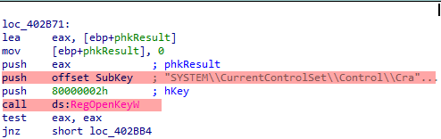
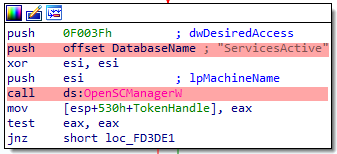

<center>

</center>

# Analysis  - Hermetic Wiper.
<h6>February 28<sup>th</sup>, 2022</h6>

Hermetic Wiper is a malware used recently on a targeted attack to Ukraine, this wiper affects the system restore capabilities by disabling the Volume Shadow Copy service,
it also corrupts the MBR by using drivers embedded in its resource section to render the systems unbootable.

The drivers are downloaded into <b>C:\Windows\System32\drivers\ </b>, this driver name will consist in two random characters plus the “dr”, generating a file like <b>C:\Windows\System32\drivers\fgrd.sys</b>.

In order to load use the drivers, the wiper is capable to adjust its own permissions allowing it to load them on memory and then execute them.

### STATIC ANALYSIS.

The bigger section is .rsrc, in where the drivers used to damage the MBR are stored.


Looking at the resources embedded, it can be seen the drivers that will be used later. The entropy is high on these drivers, which indicates these are packed, a
further look reveals that indeed are packed, TrID reports it as "Microsoft SZDD compressed".


I also like to check the strings present in the executable to start getting an idea of its capabilities.

The strings that catched my attention were the following:

* SYSTEM\CurrentControlSet\Control\CrashControl
* \\?\C:\Windows\System32\winevt\Logs
* SYSTEM\CurrentControlSet\services\
* \\?\C:\Documents and Settings
* C:\System Volume Information
* \\.\PhysicalDrive%u
* C:\Windows\SYSVOL
* \\.\EPMNTDRV\%u
* OpenSCManager 

Other strings I found interesting are related to DLLs and imported functions, those are detailed below.


## ADJUSTING ITS OWN PRIVILEGES.

The wiper will try to adjust its privileges.


Accordingly to MSDN documentation:


Other privilege modifications this sample will perform are shown in the next image.

The <i>AdjustTokenPrivileges</i> to grant itself permissions to load drivers.


## BEFORE RUNNING THE DRIVERS.

In order to load the correct driver, the wiper will check the Windows version it is running on.


Depending of the checks results, it then will load drivers for XP or for more recent windows versions.

### XP Drivers.


### Other Windows versions.


## SETTING THE DRIVERS.
The malware will download the driver in the folder: <i>C:\Windows\system32\drivers\ </i>

The format of the file is <b>??dr.sys</b>,  where the ‘??’ is a placeholder for 2 random characters generated by the malware.

In my case, the file name was the following:


Opening this file with PEStudio reveals the same hash as the drivers stored in the malware resource section.


To launch this driver, the wiper will use the functions: <i>OpenSCManagerW, OpenServiceW, CreateServiceW</i> and <i>StartServiceW</i>, when the drivers are loaded as
service in this way, a registry key is added, and will be removed later as soon the driver is loaded in memory.

## REGISTRY MANIPULATION.
The wiper will disable reports about crashes by setting the value to 0.




The following registry key will be deleted (it was created before when launching the driver as service) and the wiper will delete it later as soon as
the driver is loaded in memory.


## DISABLING THE VOLUME SHADOW COPY SERVICE (VSS).
The malware also disable the service Volume Shadow Copy Service (VSS).




The value <b>4</b> pushed into the stack will be used to set the service status to disabled.


## LIST PHYSICAL DRIVES.


This function is used to list physical drivers, it will loop from 0 to 100, generating strings like PhysicalDrive0, PhysicalDrive2... And so on.
There is also code to write the MBR with 512 bytes to corrupt it.

## IOCs.
### Hermetic Wiper.

| md5	|	3F4A16B29F2F0532B7CE3E7656799125 |
| sha1|	61B25D11392172E587D8DA3045812A66C3385451 |
| sha256	| 1BC44EEF75779E3CA1EEFB8FF5A64807DBC942B1E4A2672D77B9F6928D292591|

### Drivers.

| DRV_XP_X86 |	EB845B7A16ED82BD248E395D9852F467 |
| DRV_X86	 |	231B3385AC17E41C5BB1B1FCB59599C4 |
| DRV_XP_X64 | 095A1678021B034903C85DD5ACB447AD |
| DRV_X64	 |	A952E288A1EAD66490B3275A807F52E5 |


### Strings.
* \\?\C:\Windows\System32\winevt\Logs
* SYSTEM\CurrentControlSet\services\
* \?\C:\Documents and Settings
* C:\System Volume Information
* Hermetica Digital Ltd1
* \\.\PhysicalDrive%u
* C:\Windows\SYSVOL
* \\.\EPMNTDRV\%u
* OpenSCManager
* DRV_XP_X64
* DRV_XP_X86
* DRV_X64
* DRV_X86

### Yara Rule.

```
import "hash"

rule wiper {
	meta:
		author = "jairo"
		date = "02.27.2022"
		description = "Rule to detect Hermetic Wiper"
		
	strings:
		$string1 = "DRV_X86" wide ascii nocase
		$string2 = "DRV_X64" wide ascii nocase
		$string3 = "DRV_XP_X64" wide ascii nocase
		$string4 = "DRV_XP_X86" wide ascii nocase
		$string5 = "EPMNTDRV" wide ascii nocase
		$string6 = "PhysicalDrive%u" wide ascii nocase
		$string7 = "C:\\Windows\\SYSVOL" wide ascii nocase
		$string8 = "Hermetica Digital" wide ascii nocase
		
	condition:
		uint16(0) == 0x5A4D and all of them
		
}
```

## References.

* http://www.ioctls.net/ 
* https://docs.microsoft.com/en-us/windows/win32/api/winsvc/nf-winsvc-changeserviceconfigw
* https://docs.microsoft.com/en-us/windows-hardware/drivers/install/hklm-system-currentcontrolset-services-registry-tree
* https://www.tarlogic.com/es/blog/explotacion-de-la-directiva-cargar-y-descargar-controladores-de-dispositivo-seloaddriverprivilege/
* https://docs.microsoft.com/en-us/windows/win32/secauthz/privilege-constants
* https://docs.microsoft.com/en-us/windows-hardware/drivers/ifs/privileges


