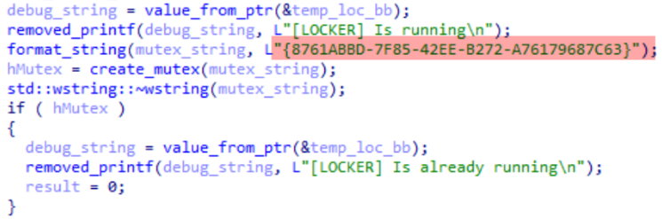

<center>

</center>


# Malware Vaccines Using Infection Markers.
<h6>May 26th<sup>th</sup>, 2022</h6>

Who don't know what a vaccine is, or at least have an idea of what it is and do? 
Specially since the last covid-19 pandemic, vaccines became a topic of everyday. 

But are you aware vaccines are not only for living beings?
Vaccines can be for computers too, well not in the strict sense of the word, but there is a technique to fight malware that is also called vaccination and have some similarities to human vaccines.

### What is a malware vaccine?
Malware vaccines consist in the usage of malware's characteristics and artifacts to make the malware itself to function incorrectly or to stop it's main objective. Like the biological vaccines that uses virus proteins to trigger an inmune response, the malware vaccination uses malware artifacts called “infection markers”.
The infection markers can be registry keys, mutexes, processes, files... etc. 

Anything used by a malware to identify if the device was already infected by other instance of the same family can be used for vaccination.

### Why malware use infection markers?
Malware coders do not want to infect a system multiple times, this is counterproductive and risky since this can cause the operating system to malfunction and crash and can also hint 
about the presence of malware in a pc.

For example, in a ransomware infection, it is of no use to encrypt the files twice or more, it is not efficient, that is why malware will create these infection markers so when the malware 
detects these artifacts it will stop the encryption process.

Other example is the situation of malware hidding deep in the operating system, since the kernel is the core of the operating system the infection process is risky and can crash the system, if a malware attacks multiple times the kernel then this can be catastrophic and malware author's will then loss a device for their nefarious purposes.

In order for an infection marker to be effective for both malware and vaccination it will need to be persistent and deterministic.

<b>Persistent:</b> In this context, the infection marker have to be present in the system when another malware of the same family tries to attack it. To be persistent the marker need to be stored in a hard drive, bios... etc. In other words, any medium that allow the malware to survive a computer restart.

<b>Deterministic:</b> This means that the location, name and structure can be determined by any other malware instance of the same family, if a malware generates a random name for a file on a random location, then other  malware running will not be able to detect the marker and will try to infect the pc when another instance did it before.

But like the cold and flu virus that mutates every year and create new strains, malware can mutate too and render these infection markers ineffective.

By  mutation in this context I mean that at the time a malware vaccine is released, malware coders will then change that artifact in newer malware versions creating a “new strain” that is 
not affected by the vaccine, in other words, newer versions of these programs will infect the systems even if the vaccine from it's previous strain is applied in the computer, therefore malware can no be longer tricked to make it stop it's main goal.

Let's see a practical example using the Medusa ransomware.

The Medusa ransomware checks for the existence of a mutex with the name <b>"{8761ABBD-7F85-42EE-B272-A76179687C63}"</b>.

If Medusa finds this mutex, then it will exit prematurely and will not perform its main goal (encrypt all files) because this mutex indicates that another instance of the same malware is
active in the computer.



It is then possible to stop the Medusa's encryption process by creating our own mutex with the same name.

The next Go code will create the mutex used by Medusa.
```go
package main

import (
	"fmt"
	"syscall"
	"time"
	"unsafe"

	"golang.org/x/sys/windows"
)

const MUTEX = "{8761ABBD-7F85-42EE-B272-A76179687C63}"

func main() {
	fmt.Println("[*] Creating mutex: ", MUTEX)

	kernel32dll := windows.NewLazyDLL("kernel32.dll")
	createMutexW := kernel32dll.NewProc("CreateMutexW")

	_, _, err := createMutexW.Call(
		uintptr(0x00000000),
		uintptr(0x00000000),
		uintptr(unsafe.Pointer(syscall.StringToUTF16Ptr(MUTEX))),
	)

	if err.Error() != "The operation completed successfully." {
		fmt.Println(err)
		return
	}

	fmt.Println("[*] Mutex successfully created! ")

	time.Sleep(240 * time.Second)
}
```
When this program and Medusa ransomware are executed at the same time, Medusa will stop since it will see the mutex active and will determine that another Medusa instance is already running (which is not true since this time the mutex is created by another program that is in my control, the mutexCreate.exe vaccine).

First I launched the mutexCreate.exe to create the mutex, then I tried to launch the Medusa malware. Medusa detected the mutex and finished execution prematurely. 
That is why Medusa did nothing when I executed it.

In the second attempt, I ran Medusa without the mutexCreate.exe, in this second attempt the ransomware did not found the mutex and considered the vm as not infected so the malware did proceed to encrypt the files as expected.


<a href="images/medusaMutex.gif"> View in a complete page.</a>

Using infection markers can be useful to fight malware, but hardly could prevent a malware pandemic, first malware analysts will need to check the malware in order to find a good infection marker that can be used to trick the malware and this could take time (depending how resitant is the malware to analysis). In 2017, WannaCry did infect 200,000 computers in just a few hours, luckily an analyst (Marcus Hutchins) discovered a killswitch to stop the WannaCry propagation, What would have happened if the analysts had taken more time to discover the killswitch?

I think this method could be useful to protect legacy systems old enough that no anti malware solution is compatible or the resources too restricted that sysadmins can't afford to run more programs.

Let's consider the following scenario, the worm Conficker did appear in 2008 and it is still active lurking on the networks today, this worm also uses infection markers to determine if a computer is already infected, if a vaccine is applied in an old system then IT staff will be able to gain some time to further protect the systems since Conficker will detect the infection marker and will stop, this vaccine will not remove the infection but certainly will give some precious time to react.

Using infection markers can be useful in some situations to deter malware infections, but not should be used alone, since changing the infection markers is easy for the malware coders, this technique could be paired with other ones that also exploits malware features against it. Other problem with infection markers is that anti malware solutions can detect the artifact and could remove it and will create false positives in too.

In the second part I will write about how the malware's defense mechanisms can be used to stop it by simulating an analysis environment.


## References.
<font size=2px>
<ul>
<li>University of Bonn. <i>Using Infection Markers as a Vaccine against Malware Attacks.</i> https://net.cs.uni-bonn.de/fileadmin/user_upload/wichmann/Infection_Markers_as_Vaccine_against_Malware.pdf </li>
<li>Real Security. <i>TAU Threat Analysis: Medusa Locker Ransomware.</i> https://www.real-sec.com/2020/06/tau-threat-analysis-medusa-locker-ransomware/ </li>
<li>MSDN (2021) <i>CreateMutexA function (synchapi.h)</i>. https://docs.microsoft.com/en-us/windows/win32/api/synchapi/nf-synchapi-createmutexa </li>
<li>Security Intelligence. <i>Where Everything Old is New Again: Operational Technology and Ghosts of Malware Past.</i> https://securityintelligence.com/posts/operational-technology-ghost-malware-past/</li>
<li>University of Bonn. <i>Containing Conficker.</i> https://net.cs.uni-bonn.de/wg/cs/applications/containing-conficker/ </li>
</ul>
