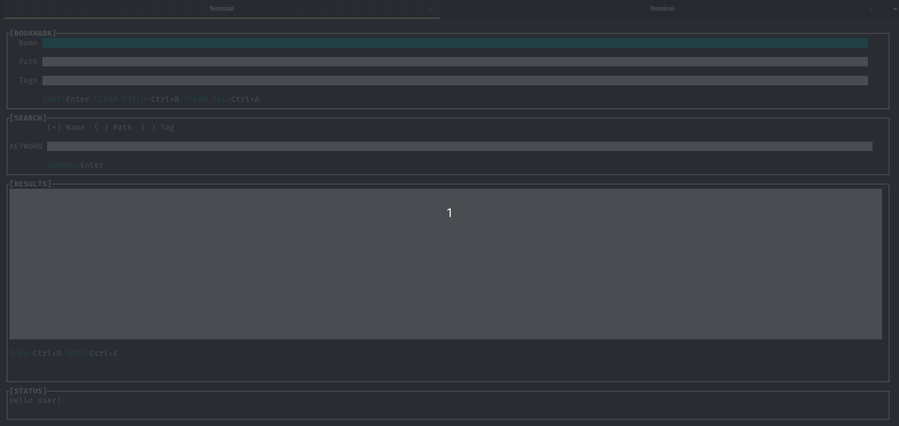

# CLI Bookmark Manager.
<h6>May 28thth, 2022</h6>

I had plans to investigate a little bit more about malware vaccines, but my ADHD kicked in and I switched projects.

With this investigation I managed to accumulate hundreds of bookmarks and there are a mess, I wondered if I could create a tool for that, and I thought, why not?

I then went in a coding rampage this afternoon and created a small tool to manage bookmarks from the command line (I like the CLI a lot!), this tool is not perfect and need further
improvements, also the code right now is pretty ugly and I expect to polish that in the incoming weeks, but what matter to me is that the program works for my needs. I can add, edit
and search bookmarks, deletion is pending yet. Also another important aspect is that I had fun :) .

This is a gif demo of the tool.

<a href="images/bookmarkscli_demo.gif"> View in a full window </a>
