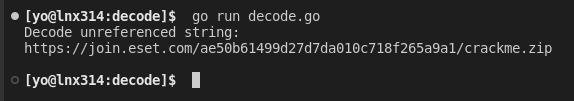

<center>

</center>


# ESET Cracking challenge.
<h6>Sep 15<sup>th</sup>, 2022</h6>

Finally, after almost 4 months, I am able to write something here.

A lession in my hand and other situations made me to drastically reduce the time spent in a computer.

In this time when I did the pause, tons of malware has been released, 
and I wasn't able to decide which one to choose to analyze, so I did opt for a cracking challenge instead XD.

### Downloading the binary

The sample can be downloaded from: https://join.eset.com/en/challenges/crack-me
This challenge consit to retrieve 3 hidden passwords.

The program can contain other resources like hidden files, text, anti debugging and other pitfalls.

### Running the program

The file downloaded is named **crackme.zip** so I tried to decompress it, but I did receive the following
error:


I had suspicions about it, maybe is not a .zip file so I did check it in HxD.


So I just changed the extension to .exe and it ran normally.

As we can see below, the program will request the user to provide a password.


Having an idea of what this program is doing, I then started by looking for strings hoping to find anything that resemble a password, but I got nothing, key strings are encoded (we will see that later).

Ok, gathering information about the strings returned nothing, and no password of course!

Since the program reads the user input and writes to the console, I started to check for api calls to write and read from the console. When I checked for **ReadConsoleA** I found pretty interesting code.


In that code I found the main logic of the program (asking for password and validating it and anti debugging techniques implemented in there). Let's check those in more detail.

### Anti Debugging.

#### IsDebuggerPresent:
The program will check if it is being debugged by calling the api **IsDebuggerPresent**, and if it is being debugged, it will terminate.


#### GetTickCount:
Using GetTickCount, the program will determine how much time it have running. The sample will use the GetTickCount in lines 41 and 46, and will save the returning value into local_18
and local_14 respectively.
Then the sample will calculate the execution time and it the time elapsed is greater that 100, then the program will terminate.


#### Process Environment Block.
We can compare this method to IsDebuggerPresent, by checking the value at _in_FS_OFFSET_ + 30 + 2 which is the byte used to determine if it is being debugged.

If this byte is set, then the program is being debugged and it will terminate execution.


### Encoding and decoding strings

Now we will check how the program encode/decode strings to show some messages to us.

The first function used to deobfuscate strings is FUN_004013A0 which I renamed to **encodeDecode**

This function will iterate on every character of a string and will xor the characters, after the first iteration (or when it reach the second char) the xor key is modified by adding to it
the value passed as argument in the mod variable.


This function is used to decode the messages for enter a password, wrong password and to show hints.

With the following Go code, and with the strings used in every function call, we can decode them beforehand.

```go
package main

import "fmt"

var (
    string1 = []byte{0x75, 0x44, 0x4e, 0x4f, 0x42, 0x51, 0x17, 0x5f, 0x53, 0x34, 0x26,
        0x34, 0x69, 0x3a, 0x2e, 0x3e, 0x3c, 0x3c, 0x7b, 0x2e, 0x00, 0x17, 0x14, 0x1d,
        0x02, 0x02, 0x17, 0x56, 0x43, 0x5c, 0x7f, 0x00}

    string2 = []byte{0x41, 0x6f, 0x4b, 0x45, 0x55, 0x19, 0x30, 0x26, 0x3d,
        0x26, 0x2b, 0x0c, 0x18, 0x15, 0x59, 0x75, 0x86}

    string3 = []byte{0x33, 0x50, 0x73, 0x4e, 0x42, 0x0b, 0x47, 0x5a, 0x48, 0x54,
        0x6a, 0x69, 0x02, 0x3a, 0x2c, 0x29, 0x0e, 0x02, 0x4c, 0x19, 0x13, 0x17,
        0xf0, 0xbf, 0x80, 0xec, 0xfc, 0xf8, 0xec, 0xf8, 0x90, 0xf0, 0x92, 0x8a,
        0x9c, 0xf9, 0xf3, 0xc1, 0xb3, 0xbd, 0xbb, 0xad, 0xbf, 0xd9, 0xb3, 0xd3,
        0xd3, 0xdd, 0x61, 0x6f, 0x6d, 0x63, 0x4d, 0x29, 0x7d, 0x05, 0x17, 0x0f,
        0x05, 0x0b, 0x06, 0x49, 0x2b, 0x25, 0x33, 0x25, 0x07, 0x55, 0x3b, 0x4b,
        0x5d, 0x55, 0x19, 0x17, 0xe5, 0xfb, 0xd5, 0xa4, 0xc5, 0xbd, 0x9f, 0x87,
        0x81, 0x84, 0x86, 0xb1, 0xa3, 0xad, 0xab, 0xbd, 0x8f, 0xef, 0x83, 0xc3,
        0xc3, 0xcd, 0x91, 0x9f, 0x9d, 0x73, 0x5d, 0x32, 0x4d, 0x35, 0x27, 0x3f,
        0x16, 0x18, 0x17, 0x39}
)

func main() {
    fmt.Println("String #1:")
    decode(string1, 37, 3)

    fmt.Println("String #2:")
    decode(string2, 22, 7)

    fmt.Println("String #3:")
    decode(string3, 18, 5)
}

func decode(s []byte, k, m byte) {
    for i, c := range s {
        if i == 0 {
            fmt.Printf("%c", c^k)
        } else {
            k += m
            fmt.Printf("%c", c^k)
        }
    }
    fmt.Printf("\n\n")
}
```
Decoding the strings reveals a hint, using this hint and the comparisons made in the if statement (it will be checked later) it will be possible to build a correct password.


Now there is a if statement in where the program checks multiple sums of characters, these checks will evaluete to true if the sum of the characters are correct, which means that
the password is correct.

Here we can see the comparisons made by the program.


In the text below, I wrote the same comparisons made in the if statement to make it clearer.

* **char7 + char6 + char3 = 0x13a**
  
	char7 + char6 + char3 = 314
  
	char7 + char6 = 314-109
  
	char7 + char6 = 205

* **char8 + char5 = 201**

* **char9 + char4 + char8 + char5 = 0x16f**

	char9 + char4 + char8 + char5 = 	367

	char9 + char4 = 367-85-116

	char9 + char4 = 166

* **char1 + char0 = 0xc2**

	char1 + char0 = 194

* **char0 + char1 + char2 + char3 + char4 + char5 + char6 + char7 + char8 + char9 = 0x39b**

	char2 = 39b−c2−16f−13a

	char2 = 0x30 = 48 in decimal

Using the hint we can calculate new values.

* **char0 + char2 = 128**

	char0 = 128 - 48 

	char0 = 80 

* **char1 + char0 = 194**

	char1 = 194 - 80

	char1 = 114 

At this point we can reconstruct almost the whole password.

* char0 = 80 ‘P’
* char1 = 114 ‘r’
* char2 = 48 ‘0’ 
* char3 = 109	‘m’
* char4 = ?
* char5 = 116 	‘t'
* char6 = ?
* char7 = ?
* char8 = 85 ‘U’ 
* char9 = ?

There are only 4 characters left to guess. And because I got bored with the calculations to get the characters, I created a program to brute force it.

```go
package main

import (
    "fmt"
    "math/bits"
    "os"
)

func main() {
    char0 := 33
    char2 := 33
    char3 := 33
    char5 := 33

    for {
        pass := fmt.Sprintf("Pr0m%ct%c%cU%c",
            char5,
            char3,
            char2,
            char0,
        )

        check1 := uint(pass[7]) + uint(pass[6])
        check2 := uint(pass[8]) + uint(pass[5])
        check3 := uint(pass[7]) + uint(pass[6]) + uint(pass[3])
        check4 := uint(pass[9]) + uint(pass[4]) + uint(pass[8]) + uint(pass[5])
        check5 := uint(pass[1]) + uint(pass[0])
        check6 := uint(pass[0]) + uint(pass[1]) + uint(pass[2]) + uint(pass[3]) + uint(pass[4]) + uint(pass[5]) + uint(pass[6]) + uint(pass[7]) + uint(pass[8]) + uint(pass[9])

        fmt.Println(pass)
        if check1 == 205 && check2 == 201 && check3 == 314 && check4 == 367 && check5 == 194 && check6 == 923 {
            hashString(pass)
        }

        char0 += 1

        if char0 == 126 {
            char0 = 33
            char2 += 1
        }

        if char2 == 126 {
            char2 = 33
            char3 += 1
        }

        if char3 == 126 {
            char3 = 33
            char5 += 1
        }

        if char5 == 126 {
            break
        }
    }
}

func hashString(s string) {
    var results uint32 = 0

    for i := 0; i < 10; i++ {
        results = uint32(s[i]) ^ (bits.RotateLeft32(results, -9) | bits.RotateLeft32(results, 23))
        if results == 422115604 {
            fmt.Println("FOUND! ", s)
            os.Exit(0)
        }
    }
}
```

Applying the information we have now, it is possible to guess the password. In the previous code, the first IF statement do a series of comparisons using the password characters, if
the characters are correct, the if will evaluate to true, but at that point, the password is almost correct, there are multiple combinations that can generate the sums used in the check variables.

To get the correct password, my code implement the same hashing algorithm used by the crackme challenge. If the hash is 422115604, the password is 100% correct!

In the meantime my bruteforcing tool runs, I went to lunch and watch some episodes of The Big Bang Theory jaja. When I returned, my program printed a password that matched the criteria.


The password seems to be correct, so I did test it with the crackme as follows.


Accordingly to the last message, there is a hidden string that we need to decode too.
I found the string and added it into a new Go decoding tool.

To create the decoding tool, I did check the function used to display the success message.


Here is the implementation of that algorithm in Go.

```go
package main

import "fmt"

var (
    string1 = []byte{0x3a, 0x00, 0x46, 0x1f, 0x46, 0x4c, 0x45, 0x48, 0x3d, 0x1a,
        0x3b, 0x1a, 0x1c, 0x0a, 0x46, 0x13, 0x1e, 0x49, 0x34, 0x1a, 0x3f, 0x5b, 0x53,
        0x0a, 0x00, 0x46, 0x08, 0x51, 0x66, 0x41, 0x6b, 0x4d, 0x56, 0x5d, 0x02, 0x12,
        0x5d, 0x03, 0x36, 0x45, 0x63, 0x44, 0x51, 0x58, 0x04, 0x4e, 0x0c, 0x55, 0x61,
        0x40, 0x33, 0x4d, 0x53, 0x5e, 0x1a, 0x15, 0x18, 0x06, 0x34, 0x1e, 0x3f, 0x11,
        0x1c, 0x15, 0x5c, 0x06, 0x6a}

    password = "Pr0m3theUs"
)

func main() {
    fmt.Println("Decode unreferenced string:")
    decode(string1)
}

func decode(s []byte) {
    for i, c := range s {
        fmt.Printf("%c", int(c)^(int(password[i%10])+0x2))
    }
    fmt.Printf("\n\n")
}
```


And it works!! There is a link to the second part of the challenge!


